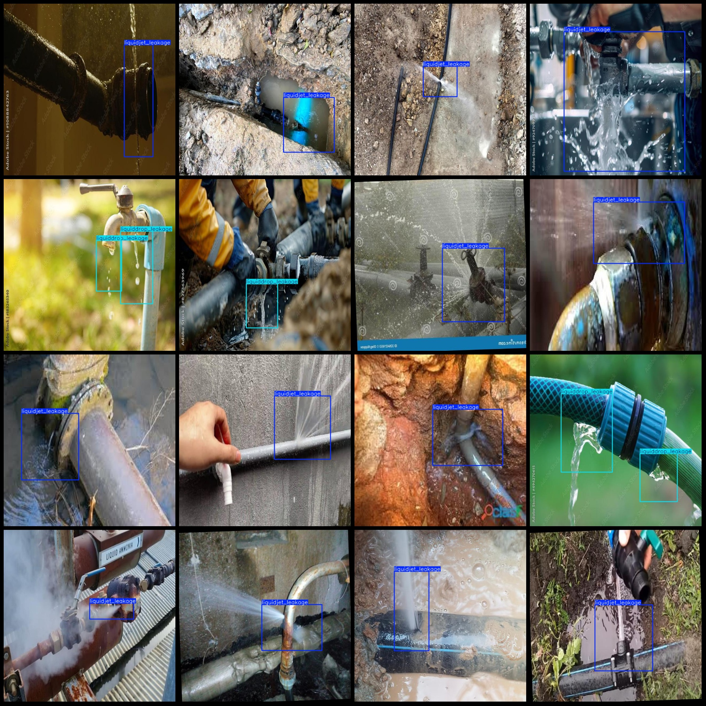
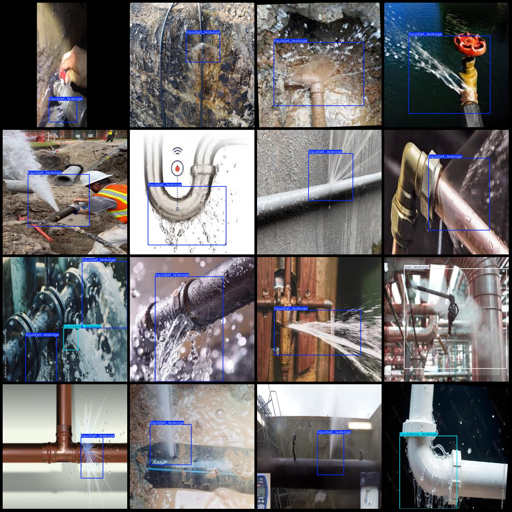

# Liquid Gas Leakage Detection Dataset: VOC+YOLO Format, 2099 Images in 3 Categories

Please note that some of the images in the dataset are enhanced with rotations.
The dataset format is Pascal VOC-style + YOLO format (excluding the split path in the txt file, only containing JPG images along with their corresponding VOC-style xml files and YOLO-style txt files).
Number of images (JPG file count): 2099
Number of annotations (xml file count): 2099
Number of annotations (txt file count): 2099
Number of categories: 3
Annotation category names (Note that the order of categories in the YOLO format does not correspond to this, but is based on the labels folder's classes.txt): ["gas_leakage", "liquiddrop_leakage", 
"liquidjet_leakage"]
Box counts for each category:
- gas_leakage (gas leakage) = 215
- liquiddrop_leakage (liquid drop leakage) = 203
- liquidjet_leakage (liquid jet leakage) = 1887
Total box count: 2305
Number of images per category:
- gas_leakage (gas leakage) = 212
- liquiddrop_leakage (liquid drop leakage) = 169
- liquidjet_leakage (liquid jet leakage) = 1748
Image resolution: 640x640
Annotation tool used: labelImg
Annotation rules: draw boxes around categories
Important Notice: The dataset does not have a partitioned training, validation, and testing sets. It needs to be divided by oneself.
Special Remark: This dataset does not guarantee the accuracy of the trained models or weights files.
Image Preview:

Annotation Example:
## Images

Here is a pay link on Stripe ( https://buy.stripe.com/3cs8yP7sY87d0vu9AB ). Please contact me lonlonago@foxmail.com after funding $89, and I will send you a complete data files , thank you!

